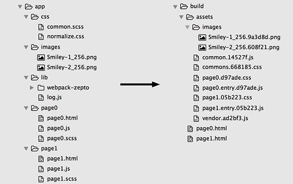
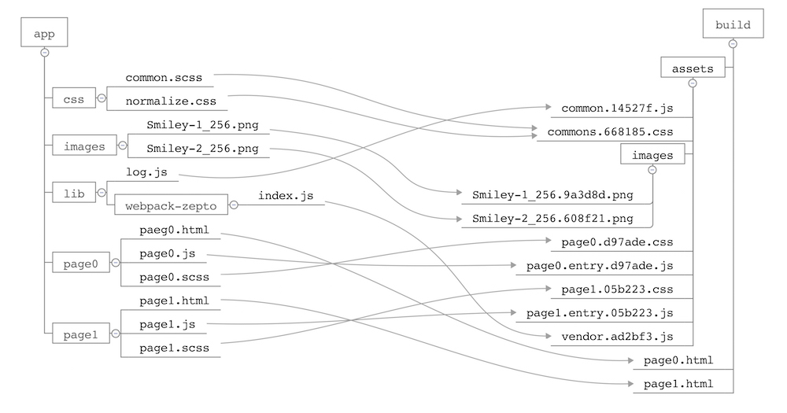

# webpack-demo
Some demo of webpack usage for presentation and reference. Enjoy it.

Before the experiment, please install the dependencies first.

```bash
$ npm i
```

[中文文档](README.zh-CN.md)

## demo0
Basic usage of Webpack.

#### Usage

```bash
$ cd demo0
$ webpack
```

## demo1
Advance usage of Webpack with the follow functions.

1. ES2015 and SASS supports
1. Code inspection, compression and confusion
1. Combine public modules
1. MD5 stamp in file name
1. Long cache supports

#### Usage

```bash
$ cd demo1
$ webpack
```





## bootstrap
Start a simple server with HMR supports for development, base on webpack-dev-server.

#### Usage

```bash
$ cd bootstrap
$ node server.js
```

Visit [http://127.0.0.1/3000](http://127.0.0.1/3000)
